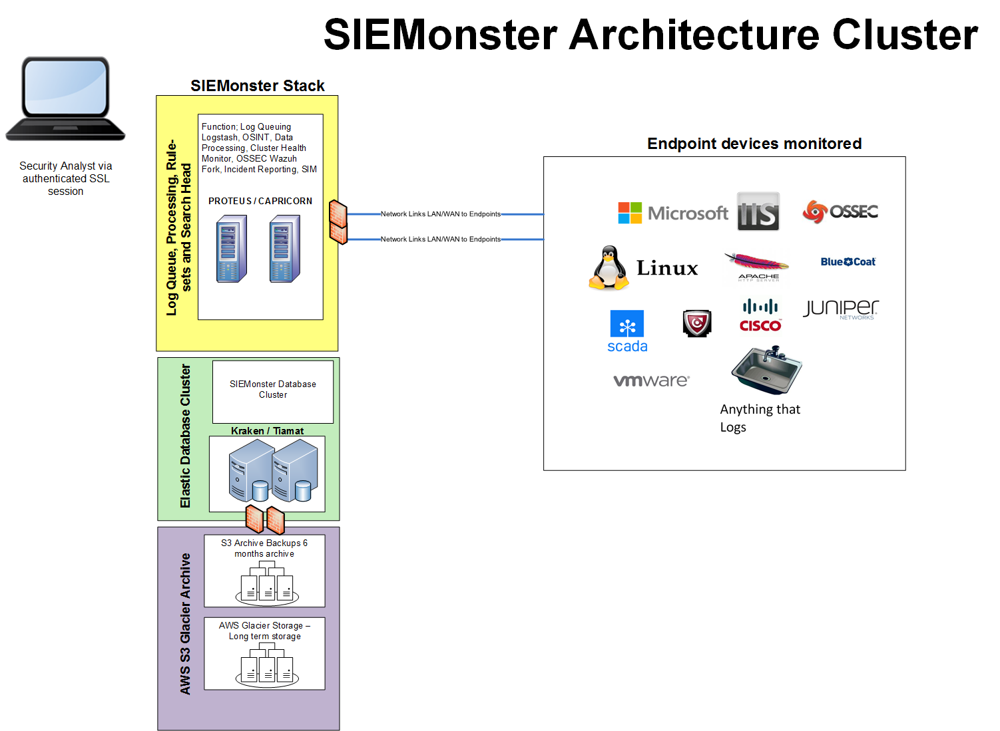

###3.4	SIEMONSTER HIGH LEVEL ARCHITECTURE DEMO OR SMALLER COMPANIES

All endpoint logs data including HIDS events are sent to Proteus. The Master node (Proteus) provides data filtering and queuing via RabbitMQ, Logstash, OSINT, and Syslog data pipelining. In the 2 node Tier Proteus also acts as an ES server data node (master eligible). The ES engine is for medium/long term data storage/analysis listed below in green. Capricorn provides the user interfaces with Kibana for data analysis and 411 used primarily for Alerting (comparable to Watcher for Elasticsearch. Set queries/searches are registered within 411 and scheduled to run every minute. The results are analysed/correlated and passed through additional filters before triggering alerts to specified targets (Email, SNS, Slack etc.). Triggered alert data is also fed back into the SIEM for long term archiving and analysis via a Kibana dashboard and is also represented on an Alert Monitor.
Node to node communications are over TLS 1.2 secured by SearchGuard SSL (similar properties to Elasticsearch Shield). Optional AWS integration in purple includes automated archiving 6 months or backups annually and maintenance.

